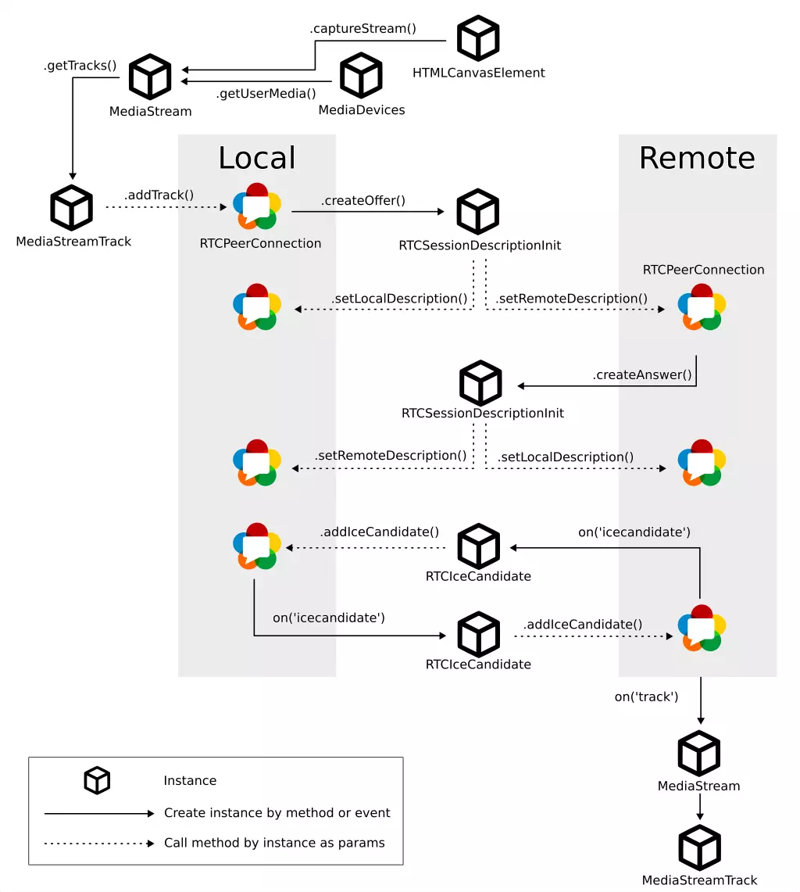

# Canvas WebRTC Sample

This project is a sample to demonstrate streaming `canvas` with [WebRTC](https://developer.mozilla.org/en-US/docs/Web/API/WebRTC_API).

## Usage

```shell
pnpm install --frozen-lockfile
pnpm run start
```

## Create WebRTC Connection

Hope this diagram would help you understanding how to create WebRTC connection and stream video:



## Interface Segregation


This project using 4 interfaces to separate duties in to 2 domain:
- Application domain: User want to send or receive video.
- Connection domain: Used to create WebRTC connection, may implemente with WebSocket in complete project.

## License

Notice, only [sample-view-source.ts](./src/sample-view-source.ts) is created by Facebook, I extracted it from [Canvas-Streaming-Example](https://github.com/fbsamples/Canvas-Streaming-Example), which have differnt license.

Other source code is written by myself, and under [MIT](./LICENSE).